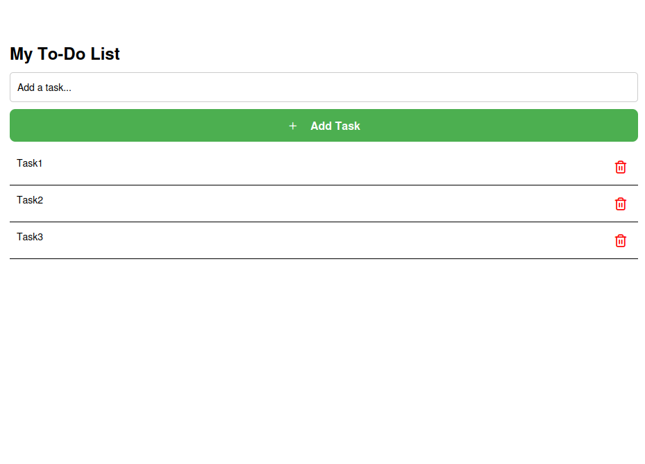
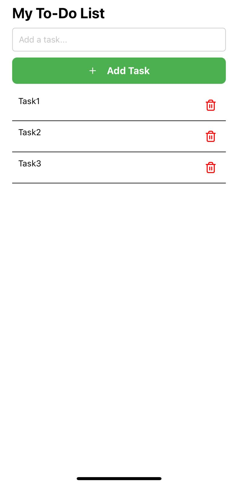

# ✅ ToDoApp — React Native + Expo

Minimalistyczna aplikacja To-Do napisana w **React Native** z użyciem **TypeScript** i **Expo**. 
Umożliwia tworzenie, usuwanie oraz oznaczanie zadań jako ukończone. 
Działa zarówno na urządzeniach mobilnych (testowane z Expo Go na iOS i Android), jak i w przeglądarce (React Native Web).

---

## 🧩 Funkcje

- 📌 Dodawanie zadań
- ✅ Oznaczanie zadań jako ukończone
- 🗑️ Usuwanie zadań
- 💾 Zapisywanie danych lokalnie przy użyciu AsyncStorage
- 🎨 Prosty i responsywny interfejs
- 💻 Działa na Web + Mobile (Expo Go)

---

## 🛠️ Technologie

- [React Native](https://reactnative.dev/)
- [Expo](https://expo.dev/)
- [TypeScript](https://www.typescriptlang.org/)
- [AsyncStorage](https://docs.expo.dev/versions/latest/sdk/async-storage/)
- [@expo/vector-icons](https://docs.expo.dev/guides/icons/)

---

## 📸 Screenshots

### 🌐 Web


### 📱 iOS (Expo Go)



---

## 🚀 Uruchomienie lokalne

1. Sklonuj repozytorium:
```bash
git clone https://github.com/kstarzyckababik/todo-app-react-native.git
cd todo-app-react-native  
npm install  
npm start

2. Otwórz : Expo Go (skanując kod QR) / Emulatorze / Przeglądarce (w → Web Preview)
